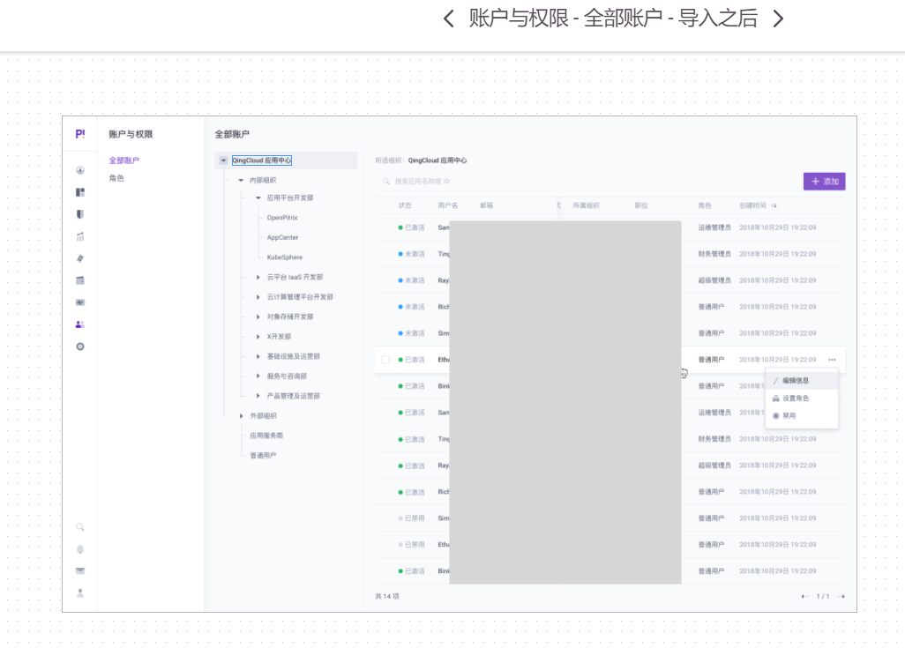
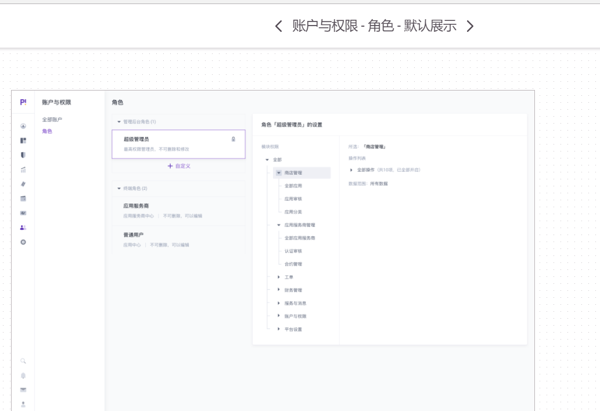

# IAM - 账户和权限

先了解和OpenPitrix业务相关的几个核心概念。然后以app商店的app增删改查为例，展示了超级用户/应用管理员/普通用户如何通过iam服务进行鉴权。

-----
## 组织部门和用户



对应 im 账号管理模块中的group和user数据库表的概念，其中group是树形的组，user是在树形组织结构的叶子位置。

group表中有个gid唯一表示了组的位置信息，比如下面每一行为一个组的gid，每个gid对应组织结构中组的路径：

```
gid: /QingCloud应用中心
gid: /QingCloud应用中心/内部组织
gid: /QingCloud应用中心/内部组织/应用平台开发部
gid: /QingCloud应用中心/内部组织/应用平台开发部/OpenPitrix
gid: /QingCloud应用中心/内部组织/应用平台开发部/AppCenter
gid: /QingCloud应用中心/内部组织/应用平台开发部/KubeSphere
gid: /QingCloud应用中心/内部组织/云平台Iaas开发部
gid: /QingCloud应用中心/内部组织/云平台Iaas开发部/...

gid: /外部组织
gid: /外部组织/应用服务商
gid: /外部组织/普通用户
```

group表中有个gid_parent唯一表示了父亲组的位置信息。如果gid_parent和gid相同，则表示为根组。比如下面几个组的对应关系：

```
# 根
gid: /
gid_parent: /

# QingCloud应用中心
gid: /QingCloud应用中心
gid_parent: /

# OpenPitrix
gid: /QingCloud应用中心/内部组织/应用平台开发部/OpenPitrix
gid_parent: /QingCloud应用中心/内部组织/应用平台开发部
```

用户处于组织结构的叶子节点。为了便于管理，OpenPitrix预置了“超级管理员”/“应用服务商”/“普通用户”。为了便于理解，我们假设reno用户拥有“超级管理员”权限，ray用户拥有“应用服务商”权限，而chai用户拥有“普通用户”。

在user表中，uid表示用户唯一的标识，gid表示用户属于的组。那么以上三个用户的信息如下：

```
# admin
uid: reno
gid: /QingCloud应用中心/内部组织/X
name: reno

# isv
uid: ray
gid: /QingCloud应用中心/内部组织/应用平台开发部
name: ray

# user
uid: chai
gid: /QingCloud应用中心/内部组织/应用平台开发部/OpenPitrix
name: chaishushan
```

目前，三个用户没有任何的操作权限。如果需要给他们配置不同级别的权限，需要给他们赋予具有不同权限的角色。

-----
## 角色管理



图中有“超级管理员”/“应用服务商”/“普通用户”三种角色。每个角色有一个唯一的角色名字，这三个角色的名字分别是role_root/role_isv/role_user。对应 am 权限管理模块中的role数据库表的概念。

我们可以将reno/ray/chai分布绑定到不同的角色：

```
reno <--> role_root
ray  <--> role_isv
chai <--> role_user
```

然后给每个角色附带一组`操作权限`规则：

```
role_root - 超级管理员
	action_rule:
		method_pattern: *.*
		namespace_pattern: [
			"/**"
		]
role_isv  - 应用服务商
	action_rule:
		mixins_rule_name: [
			"action_rule_isv_app_adder"
		]
role_user - 普通用户
	action_rule:
		method_pattern: *.*
		namespace_pattern: [
			"$gid/$uid/**"
		]
```

在操作规则中`$gid`表示账户所在的组织部门的绝对路径，`$uid`表示账号的ID。

其中 role_isv 角色包含的 action_rule_isv_app_adder 规则，在后面的操作权限部分定义。

-----
## 操作权限


每个功能对应对应 am 权限管理模块中的 action_rule 数据库表的概念。

比如应用商店管理员角色中的`增加应用`功能对应 action_rule 表中名为 `action_rule_isv_app_adder` 这个规则，规则的内容如下：

```
# action_rule_isv_app_adder
action_rule:
	name: action_rule_isv_app_adder
	method_pattern: AppManager.CreateApp
	namespace_pattern: [
		"$gid/**"
	]
```

然后将 `action_rule_isv_app_adder` 操作权限绑定到 `role_isv` 角色。

-----

## 鉴权流程

那么对于 ray 用户，他已经被绑定到了 `role_isv` 角色，因此将拥有`action_rule_isv_app_adder` 操作权限。

而 chai 用户所在到部门 `/QingCloud应用中心/内部组织/应用平台开发部/OpenPitrix` 是 ray 所在部门 `/QingCloud应用中心/内部组织/应用平台开发部` 的子部门。因此 ray 可以新建一个 app 应用，并将 app 放到 chai 用户对应到资源空间下面。

首先为AppManager服务的每个方法映射一个唯一到URL：

```protobuf
service AppManager {
	rpc CreateApp (CreateAppRequest) returns (CreateAppResponse) {
		option (google.api.http) = {
			post: "/api/AppManager.CreateApp/{app_org_path=**}"
			body: "*"
		};
	}
}

message CreateAppRequest {
	string app_owner_id = 1;  // 用户ID
	string app_org_path = 2; // App所在的路径

	// 其它参数不参与鉴权
}
```

在CreateAppRequest中，org_path对应app所属的组织结构的路径。如果org_path为空的话，则根据user_id查询所属的组织结构的路径。

下面是可能的请求URL的模式：

```
/api/AppManager.CreateApp?app_owner_id=chai
/api/AppManager.CreateApp/QingCloud应用中心/内部组织/应用平台开发部/OpenPitrix
```

因此 ray 通过以下的POST请求完成上面的操作（为chai用户创建一个app）：

```
uid: ray
POST /api/AppManager.CreateApp/QingCloud应用中心/内部组织/应用平台开发部/OpenPitrix
```

在OpenPitrix系统到gateway服务收到 ray 上述到请求之后：

1. 首先对 ray 进行登陆验证（此处细节省略），如果登陆成功则到下一步
1. 将用户对账号和请求的URL，交给 `openpitrix/pkg/iam.CanDoAction` 包做鉴权（此包待实现）
1. 上一步对包会将URL解码为两个部分：`AppManager.CreateApp`表示服务的方法；`/QingCloud应用中心/内部组织/应用平台开发部/OpenPitrix`表示资源对应的名字空间
1. 将 uid(ray)/服务的方法/资源对应的名字空间 发送给 am 服务做鉴权
1. am 服务查询内部的角色用户绑定关系表，得知 ray 被当定到了 role_isv 角色
1. 而 role_isv 角色包含了 action_rule_isv_app_adder 操作权限

action_rule_isv_app_adder 操作权限在前面已经定义过，内容如下：

```
# action_rule_isv_app_adder
action_rule:
	name: action_rule_isv_app_adder
	method_pattern: AppManager.CreateApp
	namespace_pattern: [
		"$gid/**"
	]
```

那么说明 ray 用户绑定的 role_isv 角色拥有 AppManager.CreateApp 服务方法的调用权限，
同时对名字空间 `$gid/**` 下的资源有操作权限。

将名字空间 `$gid/**` 中的gid展开为 ray 所在的部门组织，最终操作权限对应的名字空间规则为
`/QingCloud应用中心/内部组织/应用平台开发部/**`，其中`**`表示可以跨越路径分割符进行任意匹配。

因此ray具备下面操作的权限：

```
uid: ray
POST /api/AppManager.CreateApp/QingCloud应用中心/内部组织/应用平台开发部/OpenPitrix
POST /api/AppManager.CreateApp?app_owner_id=chai
```

因此 iam 模块将放行，交给 AppManager 的服务进行业务处理。


-----
## 用例1: 创建App

假设需要创建以下App资源

```
/api/QingCloud应用中心/内部组织/应用平台开发部/OpenPitrix/chai/simple-app
```

系统有3个用户：

1. reno: 超级管理员，所在组为：`/QingCloud应用中心/内部组织`
2. ray: ISV管理员，所在组为：`/QingCloud应用中心/内部组织/应用平台开发部`
3. chai: 普通用户，所在组为 `/QingCloud应用中心/内部组织/应用平台开发部/OpenPitrix`

创建App对应的服务为：

```protobuf
service AppManager {
	rpc CreateApp (CreateAppRequest) returns (CreateAppResponse) {
		option (google.api.http) = {
			post: "/api/AppManager.CreateApp/{app_path=**}"
			body: "*"
		};
	}
}

message CreateAppRequest {
	string app_path = 1; // App所在的路径

	// 其它参数不参与鉴权
}
```

### A，由超级管理员reno创建

```
POST /api/AppManager.CreateApp/QingCloud应用中心/内部组织/应用平台开发部/OpenPitrix/chai/simple-app
```

reno被绑定到了role_root角色，角色的操作权限如下：

```
role_root - 超级管理员
	action_rule:
		method_pattern: "/api/*.*"
		namespace_pattern: [
			"/**"
		]
```

鉴权流程：

1. 验证登陆
2. 根据uid找到role_root角色
3. 根据role_root角色获取操作的模式为`/api/*.*`，可以匹配URL中的"/api/AppManager.CreateApp"部分（POST不需要处理）
4. 数据模式为`/**`，可以匹配 `/QingCloud应用中心/内部组织/应用平台开发部/OpenPitrix/chai/simple-app` 部分
5. 正常调用AppManager服务（不需要了解IAM的信息）

### B，由商店管理员ray创建

ray被绑定到了role_isv角色，角色的操作权限如下：

```
role_isv  - 应用服务商
	action_rule:
		method_pattern: "/api/*.*"
		namespace_pattern: [
			"$gid/**"
		]
```

鉴权流程：

1. 验证登陆
2. 根据uid找到role_isv角色
3. 根据role_isv角色获取操作的模式为`/api/*.*`，可以匹配URL中的"/api/AppManager.CreateApp"部分（POST不需要处理）
4. 数据模式为`$gid/**`，将`$gid`展开为ray所在的组，对应`/QingCloud应用中心/内部组织/应用平台开发部/**`，因此可以匹配`/QingCloud应用中心/内部组织/应用平台开发部/OpenPitrix/chai/simple-app` 部分
5. 正常调用AppManager服务（不需要了解IAM的信息）

### C，由普通用户chai创建

chai被绑定到了role_user角色，角色的操作权限如下：

```
role_user  - 普通成员
	action_rule:
		method_pattern: "/api/*.*"
		namespace_pattern: [
			"$gid/$uid/**"
		]
```

鉴权流程：

1. 验证登陆
2. 根据uid找到role_user角色
3. 根据role_user角色获取操作的模式为`/api/*.*`，可以匹配URL中的"/api/AppManager.CreateApp"部分（POST不需要处理）
4. 数据模式为`$gid/$uid/**`，将`$gid`和`$uid`用chai所在的组和ID替代，对应`/QingCloud应用中心/内部组织/应用平台开发部/OpenPitrix/chai/**`，因此可以匹配`/QingCloud应用中心/内部组织/应用平台开发部/OpenPitrix/chai/simple-app` 部分
5. 正常调用AppManager服务（不需要了解IAM的信息）

-----
## 用例2: 删除App

假设需要删除以下App资源

```
/api/QingCloud应用中心/内部组织/应用平台开发部/OpenPitrix/chai/simple-app
```

系统有3个用户：

1. reno: 超级管理员，所在组为：`/QingCloud应用中心/内部组织`
2. ray: ISV管理员，所在组为：`/QingCloud应用中心/内部组织/应用平台开发部`
3. chai: 普通用户，所在组为 `/QingCloud应用中心/内部组织/应用平台开发部/OpenPitrix`

删除App对应的服务为：

```protobuf
service AppManager {
	rpc DeleteApp (DeleteAppRequest) returns (DeleteAppResponse) {
		option (google.api.http) = {
			delete: "/api/AppManager.DeleteApp/{app_path=**}"
			body: "*"
		};
	}
}
message DeleteAppRequest {
	string app_path = 1; // App所在的路径

	// 其它参数不参与鉴权
}
```


### A，由超级管理员reno删除

```
DELETE /api/AppManager.DeleteAppRequest/QingCloud应用中心/内部组织/应用平台开发部/OpenPitrix/chai/simple-app
```

reno被绑定到了role_root角色，角色的操作权限如下：

```
role_root - 超级管理员
	action_rule:
		method_pattern: "/api/*.*"
		namespace_pattern: [
			"/**"
		]
```

鉴权流程：

1. 验证登陆
2. 根据uid找到role_root角色
3. 根据role_root角色获取操作的模式为`/api/*.*`，可以匹配URL中的"/api/AppManager.DeleteAppRequest"部分（DELETE不需要处理）
4. 数据模式为`/**`，可以匹配 `/QingCloud应用中心/内部组织/应用平台开发部/OpenPitrix/chai/simple-app` 部分
5. 正常调用AppManager服务（不需要了解IAM的信息）

### B，由商店管理员ray删除

ray被绑定到了role_isv角色，角色的操作权限如下：

```
role_isv  - 应用服务商
	action_rule:
		method_pattern: "/api/*.*"
		namespace_pattern: [
			"$gid/**"
		]
```

鉴权流程：

1. 验证登陆
2. 根据uid找到role_isv角色
3. 根据role_isv角色获取操作的模式为`/api/*.*`，可以匹配URL中的"/api/AppManager.DeleteApp"部分（DELETE不需要处理）
4. 数据模式为`$gid/**`，将`$gid`展开为ray所在的组，对应`/QingCloud应用中心/内部组织/应用平台开发部/**`，因此可以匹配`/QingCloud应用中心/内部组织/应用平台开发部/OpenPitrix/chai/simple-app` 部分
5. 正常调用AppManager服务（不需要了解IAM的信息）

### C，由普通用户chai删除

chai被绑定到了role_user角色，角色的操作权限如下：

```
role_user  - 普通成员
	action_rule:
		method_pattern: "/api/*.*"
		namespace_pattern: [
			"$gid/$uid/**"
		]
```

鉴权流程：

1. 验证登陆
2. 根据uid找到role_user角色
3. 根据role_user角色获取操作的模式为`/api/*.*`，可以匹配URL中的"/api/AppManager.CreateApp"部分（DELETE不需要处理）
4. 数据模式为`$gid/$uid/**`，将`$gid`和`$uid`用chai所在的组和ID替代，对应`/QingCloud应用中心/内部组织/应用平台开发部/OpenPitrix/chai/**`，因此可以匹配`/QingCloud应用中心/内部组织/应用平台开发部/OpenPitrix/chai/simple-app` 部分
5. 正常调用AppManager服务（不需要了解IAM的信息）

-----
## 用例3: 查App列表

服务为：

```protobuf
service AppManager {
	rpc DescribeApps (DescribeAppsRequest) returns (DescribeAppsResponse) {
		option (google.api.http) = {
			get: "/api/AppManager.DescribeApps/{app_path=**}"
			body: "*"
		};
	}
}
message DescribeAppsRequest {
	string app_path = 1; // App所在的路径

	// 其它参数不参与鉴权
}
```

reno查全部App列表：

```
GET /api/AppManager.DescribeApps/QingCloud应用中心
```

ray查所在组的App列表：

```
GET /api/AppManager.DescribeApps/QingCloud应用中心/内部组织/应用平台开发部
```

ray查柴的App列表：

```
GET /api/AppManager.DescribeApps/QingCloud应用中心/内部组织/应用平台开发部/OpenPitrix/chai
```


-----
## 用例4: 修改App信息

服务为：

```protobuf
service AppManager {
	rpc ModifyApp (ModifyAppRequest) returns (ModifyAppResponse) {
		option (google.api.http) = {
			patch: "/api/AppManager.ModifyAppApp/{app_path=**}"
			body: "*"
		};
	}
}
message ModifyAppAppRequest {
	string app_path = 1; // App所在的路径

	string description = 2; // 描述信息，可以修改

	// 其它参数不参与鉴权
}
```

reno修改chai的App信息：

```
PATCH /api/AppManager.ModifyApp/QingCloud应用中心/内部组织/应用平台开发部/OpenPitrix/chai/simple-app?description=abc
```

ray修改chai的App信息：

```
PATCH /api/AppManager.ModifyApp/QingCloud应用中心/内部组织/应用平台开发部/OpenPitrix/chai/simple-app?description=abc
```

ray修改chai的App信息：

```
PATCH /api/AppManager.ModifyApp/QingCloud应用中心/内部组织/应用平台开发部/OpenPitrix/chai/simple-app?description=abc
```

----
# AppManager 服务的注意事项

每个App需要保存资源所在的路径，该路径和组织部分的结构要保持一致。

比如chai要创建simple-app应用，根据chai所在的组可以得知应用对应的资源路径为“/QingCloud应用中心/内部组织/应用平台开发部/OpenPitrix/chai/simple-app”。

再组合服务的方法对应的Rest-API得到路径：“/api/AppManager.CreateApp/QingCloud应用中心/内部组织/应用平台开发部/OpenPitrix/chai/simple-app”

从数据库表查App列表时，根据App对应的资源路径做前缀匹配即可。

AppManager只要遵循Rest-API的映射规则，并不需要了解IAM服务。
