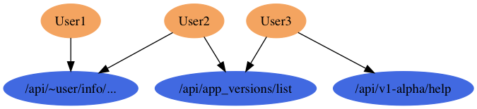

# IAM - 账号管理和权限管理服务

IAM(Identity and Access Management)是账号管理和权限管理服务管理服务的简称. IAM模块对外通过Protobuf定义GRPC接口, 其它服务通过GRPC服务访问该模块的功能.

## 目录结构

- api: Protobuf规范文件, GRPC接口规范
- cmd: 每个服务的可执行程序
- doc: 文档和图片文件, 中文以 `_zh.md` 为后缀
- pkg: Go语言包文件

----

## IM - 账号管理服务

账号管理服务, 主要管理用户信息和组信息.

----

## AM - 权限管理服务

AM模块是基于RBAC(Role Based Access Control)模型对静态的API服务资源提供鉴权管理服务.
既然AM服务时, 前端的中间件已经对实体账号进行了必要的认证.
AM服务无法处理和业务相关的权限管理(需要业务服务).

### 核心概念

RBAC重点涉及以下几个概念:

- 鉴权: 将实体的集合映射为角色集合, 判断是否有角色有权限操作
- 实体: 资源的操作者, 对应任意有唯一ID的对象, 可以是某个`用户`/`组`/`服务`
- 资源: 对应请求的一个URL路径, 表示一个资源抽象, URL必须满足一定的规则
- 角色: 用于描述一类实体, 最终的权限是角色角色来设置的
- 角色绑定: 记录实体和角色的对应关系, 实体需要转为角色后才能被授权
- 规则: 规则描述一类资源的访问权限, 一组规则授权给角色

### 对象关系示意图

- 实体: 有3个用户, 2个组
- 角色绑定: 用户和组可以独立绑定到角色
- 角色: 3个角色, 分别对应3组规则


最终每个用户对资源的权限如下:



比如一个用户实体可以绑定到多个组, 用户和不同的组均可以独立映射到一组角色.
用户鉴权时需要将uid和对应的组gid全部传入进行鉴权.

### 其它

常见的OpenPitrix的API列表:

- `GET /api/v1/repos/repo-abcd/create_time`
- `GET /api/v1/users/user-name/runtimes`
- `GET /api/v1/runtimes/rt-abcd/cpu-num`

更多URL:

```go
// app.proto

// CreateApp                 POST   /v1/apps
// GetAppStatistics          GET    /v1/apps/statistics
// DescribeApps              GET    /v1/apps
// ModifyApp                 PATCH  /v1/apps
// DeleteApps                DELETE /v1/app
// CreateAppVersion          POST   /v1/app_versions
// DescribeAppVersions       GET    /v1/app_versions
// ModifyAppVersion          PATCH  /v1/app_versions
// GetAppVersionPackage      GET    /v1/app_version/package
// GetAppVersionPackageFiles GET    /v1/app_version/package/files
// SubmitAppVersion          POST   /v1/app_version/action/submit
// CancelAppVersion          POST   /v1/app_version/action/cancel
// ReleaseAppVersion         POST   /v1/app_version/action/release
// DeleteAppVersion          POST   /v1/app_version/action/delete
// PassAppVersion            POST   /v1/app_version/action/pass
// RejectAppVersion          POST   /v1/app_version/action/reject
// SuspendAppVersion         POST   /v1/app_version/action/suspend
// RecoverAppVersion         POST   /v1/app_version/action/recover
```

请求的数据流程

<!--
RBAC的扩展信息可以放到pb里面，自动生成代码
-->

临时数据:

```
// TODO: all op url
// TODO: swagger

// GET /api/v1/repos/repo-abcd/create_time
//	verbs: GET
//	api_version: v1
//	api_group: null
//	resource: repos
//	resource_name: repo-abcd
//	sub_resource: create_time
//	non_resource: null

// get user runtimes
//	GET /api/v1/users/user-name/runtimes
//	GET /api/v1/runtimes/rt-abcd/cpu-num
```
