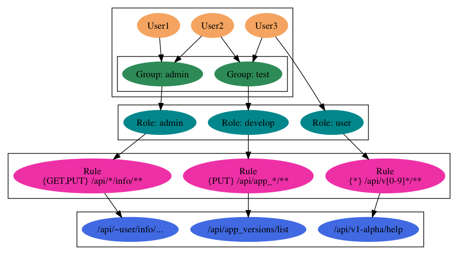

# IAM - 账号管理和权限管理服务

IAM(Identity and Access Management)是账号管理和权限管理服务管理服务的简称. IAM模块对外通过Protobuf定义GRPC接口, 其它服务通过GRPC服务访问该模块的功能.

## 目录结构

- api: Protobuf规范文件, GRPC接口规范
- cmd: 每个服务的可执行程序
- doc: 文档和图片文件, 中文以 `_zh.md` 为后缀
- pkg: Go语言包文件

## IM - 账号管理服务

账号管理服务, 主要管理用户信息和组信息.

## AM - 权限管理服务

AM模块是基于RBAC(Role Based Access Control)模型提供权限管理服务.



RBAC重点涉及以下几个概念:

- 实体: 对应用户或者是类似用户的服务
- 资源: 对应请求的一个URL路径, 表示一个资源抽象, URL必须满足一定的规则
- 角色: 用于描述一类实体, 最终的权限是真的角色来设置的
- 角色绑定: 记录实体和角色的对应关系, 实体需要转为角色后才能被授权
- 规则: 规则描述一类资源的访问权限, 一组规则授权给角色

### AM引擎的设计

1. 静态规则
1. 动态数据保存到DB中, 每个服务一个独立的表, 提供更新接口
1. 集成一个脚本语言, 每个动态规则就是一个脚本

抽象的对象:

- 实体: map对象
- 请求: 路径+动词+map对象+map参数
- 配置: 目录下的脚本文件+DB中的表格, 每个服务分开, BEGIN/END针对全部服务

<!-- 请求的路径需要规范化, 解析为静态数据和一组动态数据 -->

工作模式类似AWK, 每次权限认证类似AWK中的一行记录, 每个规则类似AWK中一个操作.
每个记录交给操作序列顺序处理, 中间可以提前成功或失败, 否则最终失败.

每个规则产生一个授权/禁止/未知的输出,
这个脚本甚至可以是Go语言模板语法定义的?

如果是脚本定义, 则可以合并多个规则, 共享中间状态.
如果是Go模板, 则每个规则需要重新运行.

### 其它

常见的OpenPitrix的API列表:

- `GET /api/v1/repos/repo-abcd/create_time`
- `GET /api/v1/users/user-name/runtimes`
- `GET /api/v1/runtimes/rt-abcd/cpu-num`

更多URL:

```go
// app.proto

// CreateApp                 POST   /v1/apps
// GetAppStatistics          GET    /v1/apps/statistics
// DescribeApps              GET    /v1/apps
// ModifyApp                 PATCH  /v1/apps
// DeleteApps                DELETE /v1/app
// CreateAppVersion          POST   /v1/app_versions
// DescribeAppVersions       GET    /v1/app_versions
// ModifyAppVersion          PATCH  /v1/app_versions
// GetAppVersionPackage      GET    /v1/app_version/package
// GetAppVersionPackageFiles GET    /v1/app_version/package/files
// SubmitAppVersion          POST   /v1/app_version/action/submit
// CancelAppVersion          POST   /v1/app_version/action/cancel
// ReleaseAppVersion         POST   /v1/app_version/action/release
// DeleteAppVersion          POST   /v1/app_version/action/delete
// PassAppVersion            POST   /v1/app_version/action/pass
// RejectAppVersion          POST   /v1/app_version/action/reject
// SuspendAppVersion         POST   /v1/app_version/action/suspend
// RecoverAppVersion         POST   /v1/app_version/action/recover
```

请求的数据流程

<!--
RBAC的扩展信息可以放到pb里面，自动生成代码
-->
