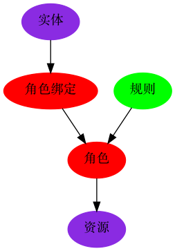

# IAM - 账号管理和权限管理服务

IAM(Identity and Access Management)是账号管理和权限管理服务管理服务的简称. IAM模块对外通过Protobuf定义GRPC接口, 其它服务通过GRPC服务访问该模块的功能.

## 目录结构

TODO

## IM - 账号管理服务

账号管理服务, 主要管理用户信息和组信息.

## AM - 权限管理服务

AM模块是基于角色提供权限管理服务.

